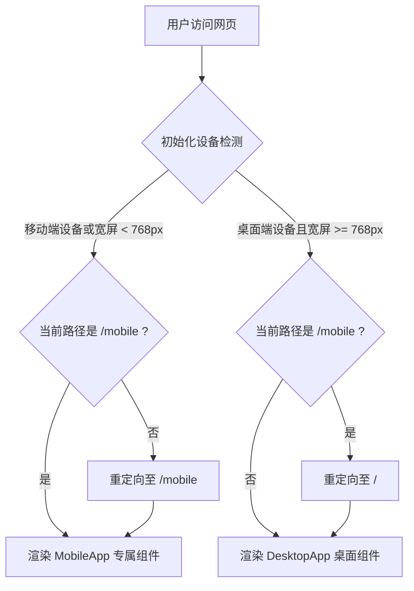

# 移动端自动识别与专属页面路由切换设计规范

**日期**：2026-07-10  
**状态**：已批准（设计阶段）  
**作者**：Antigravity  

---

## 1. 背景与目标
在现有的一森数字科技大盘监控系统 (`noon_dashboard`) 中，虽然已有基本的自适应抽屉式侧边栏，但对于小屏幕（手机端）用户而言，由于桌面端图表、宽表格及密集排版的存在，用户体验仍不够理想。

本设计旨在引入一套**自动设备识别机制**，在检测到手机访问时自动分流/重定向至移动端专属路径 `/mobile`，并渲染专为手机端优化的组件（底部导航栏、卡片化布局、简化图表等），保证两端体验的极佳呈现。

---

## 2. 架构设计与路由流程

本方案在保持无 `react-router-dom` 依赖的前提下，通过原生 HTML5 History API 实现轻量级路由分流。

### 路由流向图

---

## 3. 详细设计与实现方案

### 3.1 设备检测 Hook (`useDeviceDetect`)
在 `src/hooks/useDeviceDetect.ts` 中实现：
* **核心检测逻辑**：
  * 使用 `window.matchMedia("(max-width: 767px)")` 监听屏幕宽度。
  * 使用正则表达式检测 `navigator.userAgent`，适配 iPhone, Android, iPad 等设备。
* **返回值**：返回 `isMobile: boolean` 状态。
* **性能优化**：通过对 resize 事件进行防抖（debounce）处理，减少因屏幕旋转或拉伸窗口带来的高频重绘。

### 3.2 路由分流与重定向控制
在 `src/App.tsx` 中做如下改造：
* **路由状态**：声明 `currentPath` 状态，初始值为 `window.location.pathname`。
* **重定向副作用**：
  * 使用 `useEffect` 监听 `isMobile` 与 `currentPath` 的变化。
  * 若为移动端且 `currentPath !== '/mobile'`，调用 `window.history.pushState(null, '', '/mobile')` 并更新 `currentPath` 为 `'/mobile'`。
  * 若为桌面端且 `currentPath === '/mobile'`，调用 `window.history.pushState(null, '', '/')` 并更新 `currentPath` 为 `'/'`。
* **Popstate 监听**：注册 `popstate` 事件监听器，确保当用户使用浏览器前进/后退按钮时，能同步更新 React 状态。

---

## 4. 移动端 UI 布局与组件设计 (`MobileApp.tsx`)

### 4.1 页面骨架布局
* **动态高度**：使用 `min-height: 100dvh; display: flex; flex-direction: column;` 避免移动端浏览器地址栏伸缩导致的界面跳闪。
* **滚动区域**：内容区 `main` 采用 `flex: 1; overflow-y: auto; -webkit-overflow-scrolling: touch;`，使滚动体验顺滑。

### 4.2 专属组件规范
1. **吸顶头部 (Header)**：固定高度 56px，包含品牌 Logo、当前在线状态、以及明暗主题切换。
2. **专属底部导航栏 (Bottom Navigation)**：
   * 采用 `position: fixed; bottom: 0;`。
   * 支持三个核心选项：`大盘总览 (overview)`、`外部搜索 (scraper)`、`系统日志 (logs)`。
   * 毛玻璃效果：`backdrop-filter: blur(12px); background: var(--bg-blur);`。
   * 动效：使用 `framer-motion` 在 Tab 间切换时实现滑块缓动和点击缩放微动效。
3. **触控交互面积**：所有按钮、Tab 和表单项高度均不低于 `48px`，间距适当放宽，符合移动端人机工学规范。

---

## 5. 核心页面适配细节

### 5.1 数据总览 (MobileOverviewPage)
* **指标布局**：改为双列（2-column）或单列卡片网格。
* **折线图适配**：
  * 限制图表容器高度在 220px 左右。
  * 隐藏桌面端的 X 轴多余网格线与标签，仅保留关键节点标签（如首尾及中间日期）。
  * 适配单指滑动触发的 Recharts Tooltip 触控。

### 5.2 外部搜索 (MobileScraperPage)
* 表单元素使用 `w-full` 垂直堆叠。
* 执行任务列表由传统的宽表格切换为**折叠式任务卡片 (Collapsible Card)**，只在点击时展开详细的参数和请求日志。

### 5.3 系统日志 (MobileSystemLogsPage)
* 调整字体大小至 `11px`，单行溢出允许横向滚动或折行。
* 在右上角添加“一键复制”与“清空日志”的悬浮按钮。

---

## 6. 异常处理与边界情况

* **直接访问子路径 `/mobile`**：若非移动端访问该 URL，路由处理器将自动执行重定向，平滑跳转回 `/` 桌面页面。
* **设备状态频繁抖动**：当浏览器窗口大小在 768px 临界线来回缩放时，使用防抖延时（如 150ms）处理，防止界面发生循环重定向的死循环。
* **不支持 History API 的极端情况**：降级为使用 `window.location.replace` 进行跳转。

---

## 7. 测试与验证计划

1. **设备检测正确性**：
   * 使用 Chrome DevTools 设备模拟器（iPhone 12/14 Pro, Samsung Galaxy S20, iPad Air）测试，确认能正确重定向至 `/mobile`。
   * 在桌面浏览器全屏下输入 `/mobile`，确认能正确退回 `/`。
2. **布局表现测试**：
   * 测试动态视口高度（`100dvh`）下，底部导航栏是否始终吸附于屏幕最下方且不被系统虚拟按键遮挡。
   * 测试滑动操作及图表触碰逻辑。
3. **路由性能测试**：
   * 确认前进/后退按钮能正常响应，不会陷入“重定向-返回-重定向”死循环。
