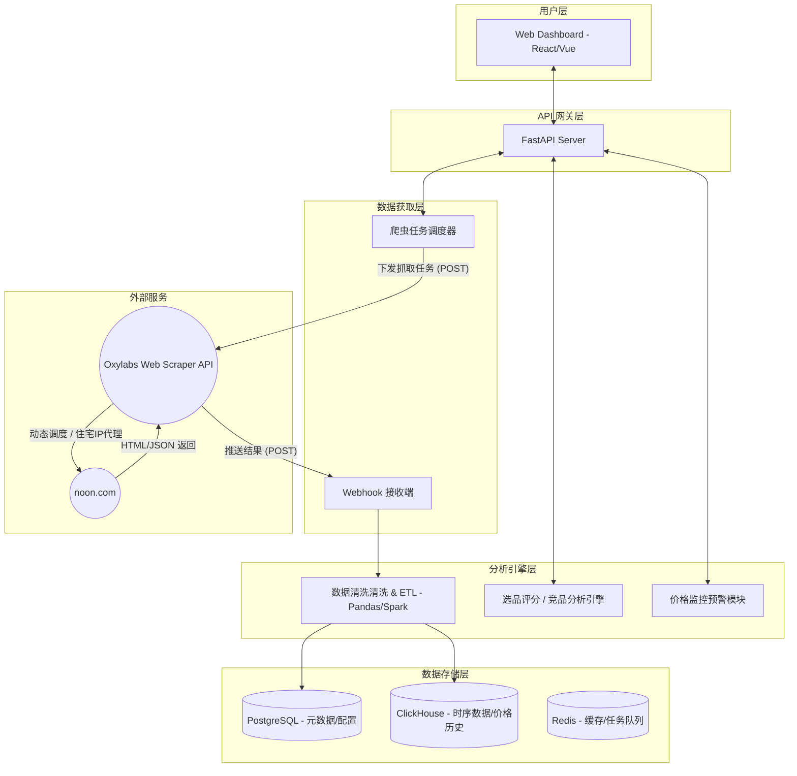
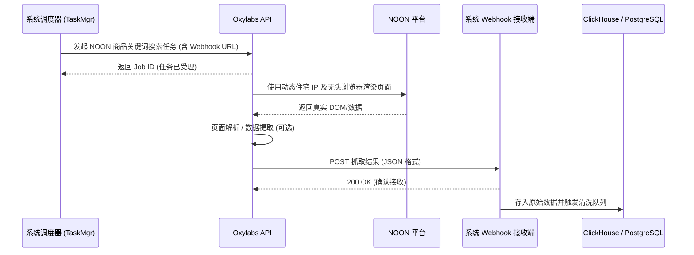

# NOON 数据分析系统高维架构设计 (基于 Oxylabs API)

基于前期的联调测试，由于 NOON 平台存在极高的反爬壁垒（Cloudflare 协议拦截、动态 DOM、验证码质询），纯本地维护爬虫集群的成本和不确定性过高。因此，系统的数据获取层正式转向对接 **Oxylabs Web Scraper API** 等企业级商业数据服务。

本设计文档着眼于更高维度的系统设计，包含数据流、存储选型及核心模块划分。

---

## 1. 核心架构演进 (v2.0)

数据采集层从“主动采集”转变为“任务下发与被动接收（Webhook）”。系统重心可以从反爬对抗转移到 **数据清洗、分析与展示**。

---

## 2. Oxylabs Webhook 对接时序

使用第三方商业 API 时，为了保证高并发性能，采用异步任务下发 + Webhook 回调的模式。

---

## 3. 核心数据表设计

数据分为关系型元数据（PostgreSQL）和分析型时序数据（ClickHouse）两类。

### 3.1 PostgreSQL (元数据库)

**Table: `tracked_products` (监控商品表)**
存储我们需要监控的 NOON 商品基础信息。

| 字段名 | 类型 | 描述 |
|--------|------|------|
| `sku` | VARCHAR(50) | NOON 唯一商品 SKU (主键) |
| `title` | VARCHAR(255) | 商品标题 |
| `brand` | VARCHAR(100) | 品牌名称 |
| `category` | VARCHAR(100) | 分类 (如 Electronics) |
| `is_express` | BOOLEAN | 是否为 NOON Express (平台自营/履约) |
| `status` | VARCHAR(20) | 追踪状态 (ACTIVE, INACTIVE) |

**Table: `scraping_tasks` (爬虫任务表)**

| 字段名 | 类型 | 描述 |
|--------|------|------|
| `job_id` | VARCHAR(100) | Oxylabs 返回的任务 ID (主键) |
| `task_type` | VARCHAR(50) | 任务类型 (SEARCH, PRODUCT_DETAIL) |
| `target_url` | TEXT | 目标 URL 或关键字 |
| `status` | VARCHAR(20) | PENDING, SUCCESS, FAILED |

### 3.2 ClickHouse (分析型时序库)

**Table: `product_price_history` (商品价格变动表)**
用于价格监控、利润核算及历史趋势绘制，每日可能产生千万级数据。

| 字段名 | 类型 | 描述 |
|--------|------|------|
| `sku` | String | 商品 SKU |
| `scrape_time` | DateTime | 数据抓取时间 |
| `price` | Float32 | 当前售价 |
| `original_price` | Float32 | 原价 (用于计算折扣) |
| `currency` | String | 货币单位 (AED, SAR, EGP) |
| `seller_name` | String | 卖家名称 (用于分析竞品) |
| `rating` | Float32 | 商品评分 |
| `review_count` | UInt32 | 评论数 |

*使用 `(sku, scrape_time)` 作为 ClickHouse 的主键和排序键 (ORDER BY)。*

---

## 4. 下一步开发计划 (Phase 1 调整)

系统设计拉升到架构维度后，代码落地的方向将转变为**构建高并发的数据接收与处理管道**。

1. **环境初始化**：使用 FastAPI 搭建高性能的 Webhook 接收端。
2. **鉴权机制**：设计 Webhook 接口的安全性，确保数据只由 Oxylabs 推送。
3. **数据清洗管道**：编写数据清洗中间件，将第三方 API 返回的复杂 JSON 结构打平，拆分到 PostgreSQL 和 ClickHouse。
4. **触发分析引擎**：当某个 SKU 的价格发生超过 10% 的变动时，如何通过消息队列（Redis/Kafka）触发系统的预警模块。
