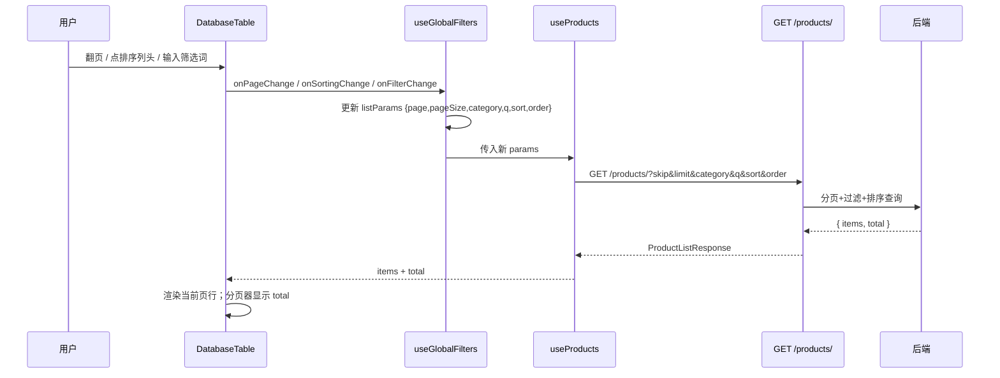
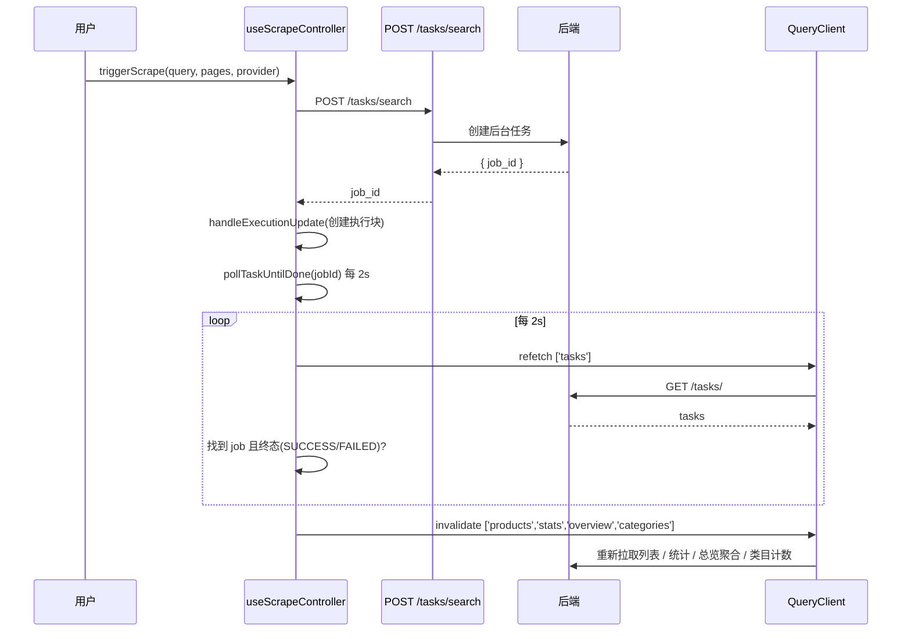

# NOON Dashboard 性能优化 · 增量架构设计 + 任务分解

> 文档类型：架构师增量设计（仅覆盖本次 P0 三件套，不重写整个项目）
> 项目：NOON Dashboard（前端 React 19 + Vite 8 + TS + TanStack Query）/ 后端 FastAPI + 异步 SQLAlchemy
> 基线：`docs/PRD_PERF_OPT.md`（P0-1 / P0-2 / P0-3）+ `ARCHITECTURE_REVIEW_REPORT.md`（5.4/10）
> 作者：架构师（补位，原架构师 agent 故障）
> 日期：2026-07-09

---

## 0. 设计基线（已核查的事实，非假设）

| 项 | 现状（已确认） | 来源 |
|---|---|---|
| 后端 `/products/` 接口 | 仅 `skip`/`limit`/`status`，固定 `order_by(updated_at.desc())`，返回**纯数组** `list[ProductResponse]`，**无 total / 无 category / 无 q / 无自定义 sort** | `noon_api/app/api/products.py:27-58` |
| 后端 `/products/stats` | 仅 `total_products / active_products / total_snapshots` 三个计数 | `noon_api/app/api/products.py:155-178` |
| 后端 `TrackedProduct.category` | 存**原始英文**类目（如 `"massage gun"`），后端**无归一化逻辑** | `noon_api/app/models/product.py:24` |
| 前端 `normalizeCategory` | 英文映射中文标签 + 类目为空/`"home appliances"` 时回退 title 关键词推断 | `noon_dashboard/src/lib/utils.ts:57-90` |
| 前端 `useProducts` | `useQuery(['products'])` 拉 `limit=10000` 全量 | `noon_dashboard/src/hooks/useProducts.ts:6-16` |
| 前端 `App.tsx` | 518 行；抓取编排 + 全局筛选 + 过滤排序 memo 全耦合 | `noon_dashboard/src/App.tsx` |
| 前端 `DatabaseTable` | 客户端 `getPaginationRowModel`/`getSortedRowModel`（全量内存分页/排序），page size 选项含 `500` | `noon_dashboard/src/components/DatabaseTable.tsx:194-206, 341` |
| 总览页图表 | `priceDistribution`/`scatterData`/`brandRanking`/`dynamicStats` **全部依赖全量 `filteredProducts` 前端聚合** | `noon_dashboard/src/pages/OverviewPage.tsx:43-147` |

**核心结论**：P0-1 必须**前后端协同**——后端先扩 `/products/`，前端再受控分页。
类目过滤（Q2）与总览图表数据源（Q3）的边界方案见第 1 节决策。

---

## 1. 实现方案

### 1.1 P0-1 商品列表 服务端分页/过滤/排序

#### 1.1.1 后端契约（见第 3 节完整 schema）
`GET /products/` 扩展为接收 `skip / limit / category / q / sort / order`，返回
`{ items: ProductResponse[], total: int }`。

- `category`：逗号分隔的**原始英文类目**值（如 `massage gun,handheld fan`）；特例值 `__UNCATEGORIZED__` 表示「原始 category 为空/空串」。
- `q`：`title/brand/category` 的模糊搜索（不区分大小写）。
- `sort`：白名单字段 `price / review_count / rating / updated_at / created_at / title / brand`；`order` ∈ `asc/desc`，默认 `updated_at desc`（与现状一致）。
- `total`：对**相同过滤条件**的 `func.count()` 结果，供分页器「共 N 条」。

#### 1.1.2 前端改造
- `useProducts` 改为**参数化**：`useProducts(params: ProductQueryParams)`，queryKey = `['products', params]`；`skip` 由 `(page-1)*pageSize` 推导。返回 `{ items, total }`。
- `DatabaseTable` 改为**受控分页/排序**：移除 `getPaginationRowModel` / `getSortedRowModel`，仅保留 `getCoreRowModel`；分页与排序状态由父组件（`DatabasePage` ← `useGlobalFilters`）持有，点击分页/排序列头触发 `onPageChange` / `onSortingChange`，驱动新的 `useProducts` 请求。分页器「共 {total} 条」改用服务端 `total`。
- `App.tsx` 删除 `filteredProducts` memo（原 291–314 行）与全量 `products` 下拉推断；过滤/排序职责下推为 query 参数。
- page size 选项收敛为 `[10, 20, 50, 100]`（移除 500，对应 PRD Q4 默认假设）。

#### Q2 决策 · 类目过滤边界方案（重点）
服务端**只能按原始英文 `category` 字段过滤**，无法复现 `normalizeCategory` 的 title 关键词推断。采用如下边界方案：

1. **新增共享常量模块** `src/lib/categoryMap.ts`，导出 `CATEGORY_LABEL_TO_ENGLISH: Record<string, string[]>`（中文标签 → 原始英文类目值列表，严格对齐 `utils.ts:57-90` 的 category 分支，见第 3 节）。
2. 用户点击某个**中文类目 tab** → `useGlobalFilters` 取出对应英文列表 → 作为 `category` 逗号串传给后端；后端 `.in_(values)` 精确匹配。
3. **「未分类」tab** 传 `__UNCATEGORIZED__`；后端按 `category IS NULL OR category = ''` 过滤。
4. **边界妥协（已文档化的已知限制，P1-3 跟进对齐）**：`normalizeCategory` 中「类目为空/`home appliances` 时靠 title 关键词推断中文标签」的商品，其**原始 `category` 为空**，服务端会把它归入「未分类」而非推断出的中文标签。这类商品在改造后会出现在「未分类」而非对应中文 tab 下——属可接受的小概率分类差异（原始类目为空的占比通常很低）。**服务端不引入 title 推断逻辑**，保持最小变更。
5. 若后续要求严格一致，再在 P1-3 让后端加归一化层；本次不动后端类目语义。

#### Q3 决策 · 总览页图表数据来源方案（重点）
总览页 4 张图表 + dynamicStats 原依赖全量 `filteredProducts`。改造后**新增后端聚合接口** `GET /products/stats/overview`，将所有前端聚合逻辑迁移到服务端，前端只负责渲染：

- 入参复用同一套过滤：`category / q`（与列表一致，支持按类目筛选总览）。
- 出参一次性返回 `summary`（替代 dynamicStats）、`price_distribution`、`price_sales_scatter`、`brand_ranking`。
- 服务端**复刻**现有前端算法（IQR 去离群 + 20 桶、品牌 TOP10、预估销量 `estimateSales`），保证排序/结果与改造前一致（PRD 验收「过滤/排序结果与改造前一致」）。
- `price_sales_scatter` 服务端**按预估销量截断 TOP 500**，防止 1 万商品时 payload 过大。
- 前端新增 `useOverviewAggregation(params)` 调该接口；`OverviewPage` 改为消费该 hook，移除对 `products`/`filteredProducts` 的依赖。

> 好处：总览页与列表分页彻底解耦——lazy 分包后首屏（总览）只拉聚合接口（小 payload），不再触达大列表数据，满足 G1/G3。

---

### 1.2 P0-2 路由级 lazy + manualChunks

- **`App.tsx`**：6 个页面（`OverviewPage / ScraperPage / FetcherPage / DatabasePage / AnalysisPage / SystemLogsPage`）的静态 `import` 改为 `React.lazy(() => import('...'))`；在 `<AnimatePresence>` 外层或每个 tab 渲染外包 `<Suspense fallback={<PageSpinner/>}>`（新增 `src/components/PageSpinner.tsx`）。
- **`vite.config.ts`**：增加 `build.rollupOptions.output.manualChunks`（函数式），按第三方包拆独立 chunk：
  - `react` / `react-dom` → `react-vendor`
  - `recharts`（含 d3 子依赖）→ `recharts`
  - `framer-motion` → `framer-motion`
  - `@tanstack/react-query` / `@tanstack/react-table` → `tanstack`
  - 其余 node_modules 落入默认 `vendor` 或按包名细分。
- 目标：单个 chunk ≤ 380KB（gzip 前）。**风险**：`recharts` 单包体积可能逼近上限（见第 8 节待明确事项），需 `npm run build` 后实测，超标则进一步拆 d3 子依赖或评估轻量图表库。

---

### 1.3 P0-3 拆分 App.tsx 上帝组件

将非布局职责抽成两个单一职责 hook，`App` 仅保留布局 + tab 出口 + 弹窗挂载，目标 ≤150 行。

- **`src/hooks/useScrapeController.ts`**：封装
  - `scraping` / `waitingForLog` / `executionBlocks` 状态
  - `handleExecutionUpdate`（原 App 48–72 行）、`handleAnalysisExecutionUpdate`（75–77）
  - `triggerScrape(query, pages, provider)`（160–196）、`pollTaskUntilDone(jobId)` 轮询（141–158）
  - 任务状态同步 `useEffect`（219–258）
  - 内部使用 `useQueryClient` + `useTasks`，终态后 `invalidateQueries(['products'] / ['stats'] / ['overview'] / ['categories'])`（**注意：需新增 `overview` 与 `categories` 两个 key 的失效**，原代码只失效 products/stats）
  - 返回 `{ scraping, waitingForLog, executionBlocks, triggerScrape, handleAnalysisExecutionUpdate }`
- **`src/hooks/useGlobalFilters.ts`**：封装
  - `searchQuery / filterText / selectedCategory` 状态
  - `sort` 状态（字段 + 方向）
  - 由上述状态 + `categoryMap` 计算出 `ProductQueryParams`（喂给 `useProducts`）与 overview 接口参数
  - 类目 tab 数据：调 `GET /products/stats/categories`（原始英文计数）→ 经 `categoryMap` 聚合为中文标签计数 → 输出 `categoryTabs: [string, number][]`
  - 返回 `{ searchQuery,setSearchQuery, filterText,setFilterText, selectedCategory,setSelectedCategory, sort,setSort, listParams, overviewParams, categoryTabs }`
- **`App.tsx` 仅留**：`activeTab` 状态、抽屉开关/`Esc`/`焦点` effect、`<PriceTrendModal>` 挂载、把上面两个 hook 的返回值接线到各页面组件 props。

---

## 2. 文件列表（前端 + 后端）

### 后端 noon_api（[修改]）
| 文件 | 改动 |
|---|---|
| `app/schemas/product.py` [修改] | 新增 `ProductListResponse`（items+total）、`OverviewStatsResponse`、`CategoryCount`；`list_products` 改用 `response_model=ProductListResponse` |
| `app/api/products.py` [修改] | 改造 `list_products` 支持 category/q/sort/order + 返回 `{items,total}`；新增 `GET /products/stats/categories`、`GET /products/stats/overview` |

### 前端 noon_dashboard
| 文件 | 改动 |
|---|---|
| `src/lib/categoryMap.ts` [新增] | `CATEGORY_LABEL_TO_ENGLISH` 反查映射 + `toEnglishCategories(label)` / `categoryLabelToParams(label)` 工具 |
| `src/hooks/useScrapeController.ts` [新增] | 抓取编排 hook（见 1.3） |
| `src/hooks/useGlobalFilters.ts` [新增] | 全局筛选 + queryParams + 类目 tab hook（见 1.3） |
| `src/hooks/useOverviewAggregation.ts` [新增] | 调 `/products/stats/overview` 的 hook |
| `src/components/PageSpinner.tsx` [新增] | Suspense fallback 轻量 spinner |
| `src/types/index.ts` [修改] | 新增 `ProductQueryParams`、`ProductListResponse`、`OverviewAggregation`、`CategoryCount`、`SortState` 等类型（见 3.3） |
| `src/hooks/useProducts.ts` [修改] | 参数化 query + 新返回结构 `{items,total}`（见 3.2） |
| `src/components/DatabaseTable.tsx` [修改] | 受控分页/排序（server-driven），移除客户端 row model |
| `src/pages/DatabasePage.tsx` [修改] | 接收 `items/total/page/pageSize/onPageChange/onSortingChange` 等新 props |
| `src/pages/OverviewPage.tsx` [修改] | 改用 `useOverviewAggregation`，移除 `products`/`filteredProducts` 依赖 |
| `src/App.tsx` [修改] | lazy 导入 6 页面 + Suspense；接入 `useScrapeController`/`useGlobalFilters`；裁剪至 ≤150 行 |
| `src/vite.config.ts` [修改] | `manualChunks` 分包 |

> 最小变更原则：不重写 `normalizeCategory`、`AnalysisPage`、`PriceTrendModal`、`SystemLogsPage` 等；仅调整数据来源与接线。

---

## 3. 接口与数据结构

### 3.1 后端 `/products/` 扩展（建议返回 `{items, total}`）

**请求**
```
GET /products/?skip=0&limit=50&category=massage%20gun&q=mini&sort=review_count&order=desc
```
| 参数 | 类型 | 默认 | 说明 |
|---|---|---|---|
| `skip` | int ≥0 | 0 | offset |
| `limit` | int 1–50000 | 20 | 单页条数（前端默认 50） |
| `status` | str | `"ACTIVE"` | 沿用 |
| `category` | str? | — | 逗号分隔原始英文类目；`__UNCATEGORIZED__` 表示空类目 |
| `q` | str? | — | title/brand/category 模糊搜索 |
| `sort` | str? | `"updated_at"` | 白名单：`price/review_count/rating/updated_at/created_at/title/brand` |
| `order` | str? | `"desc"` | `asc`/`desc` |

**响应** `ProductListResponse`
```json
{
  "items": [ { /* ProductResponse 全部字段 + price/original_price/rating/review_count */ } ],
  "total": 1234
}
```

**SQL 约束（防注入/语义）**
- `sort` 必须走白名单映射，禁止直接拼接列名。
- 允许排序列为 NULL 时用 `.nulls_last()`，保证稳定排序。
- `category` 用 `.in_(values)`；`__UNCATEGORIZED__` → `category.is_(None) | (category == '')`。
- `q` 用 `or_(col.ilike(f"%{q}%") ...)`，小写归一后匹配（SQLite 下 `ilike` 编译为 `LOWER`）。
- `total` 复用同一 `where` 条件做 `func.count()`。

### 3.2 前端 `useProducts` 新签名（伪代码）
```ts
export interface ProductQueryParams {
  page: number;          // 1-based
  pageSize: number;      // ≤100
  category?: string;     // 原始英文，逗号分隔，或 '__UNCATEGORIZED__'
  q?: string;
  sort?: 'price' | 'review_count' | 'rating' | 'updated_at' | 'created_at' | 'title' | 'brand';
  order?: 'asc' | 'desc';
}

export function useProducts(params: ProductQueryParams) {
  return useQuery<ProductListResponse>({
    queryKey: ['products', params],
    queryFn: async () => {
      const { page, pageSize, category, q, sort, order } = params;
      const res = await api.get<ProductListResponse>('/products/', {
        params: {
          skip: (page - 1) * pageSize,
          limit: pageSize,
          ...(category ? { category } : {}),
          ...(q ? { q } : {}),
          ...(sort ? { sort, order } : {}),
        },
      });
      return res.data;
    },
    placeholderData: keepPreviousData, // 翻页时不闪烁
  });
}
```

### 3.3 新增类型（`src/types/index.ts`）
```ts
export interface ProductListResponse {
  items: Product[];
  total: number;
}

export interface SortState {
  key: 'price' | 'review_count' | 'rating' | 'updated_at' | 'created_at' | 'title' | 'brand';
  direction: 'asc' | 'desc';
}

export interface CategoryCount {
  category: string | null;  // 原始英文，null 表示空
  count: number;
}

export interface OverviewAggregation {
  summary: { total_products: number; active_products: number; total_reviews: number };
  price_distribution: { name: string; productCount: number; totalReviews: number }[];
  price_sales_scatter: {
    name: string; price: number | null; sales: number; reviews: number; rating: number;
  }[];
  brand_ranking: { name: string; 商品数: number; 总评论: number; 均分: number }[];
}
```

### 3.4 `useScrapeController` 类型（伪代码）
```ts
export function useScrapeController() {
  // 内部：useQueryClient()、useTasks()
  const [scraping, setScraping] = useState(false);
  const [waitingForLog, setWaitingForLog] = useState(false);
  const [executionBlocks, setExecutionBlocks] = useState<ExecutionBlock[]>([]);

  const handleExecutionUpdate = (id, title, source, status, progress, logs) => { /* 原 48-72 */ };
  const handleAnalysisExecutionUpdate = (u: ExecutionUpdate) => { /* 原 75-77 */ };
  const pollTaskUntilDone = (jobId: string) => { /* 原 141-158，失效增 overview/categories */ };
  const triggerScrape = async (query: string, pages: number, provider: ScraperProvider) => { /* 原 160-196 */ };

  // 任务状态同步 effect（原 219-258）
  useEffect(() => { /* ... */ }, [tasks, waitingForLog]);

  return { scraping, waitingForLog, executionBlocks, triggerScrape, handleAnalysisExecutionUpdate };
}
```

### 3.5 `useGlobalFilters` 类型（伪代码）
```ts
export function useGlobalFilters() {
  const [searchQuery, setSearchQuery] = useState('');
  const [filterText, setFilterText] = useState('');
  const [selectedCategory, setSelectedCategory] = useState('All');
  const [sort, setSort] = useState<SortState>({ key: 'review_count', direction: 'desc' });

  // 类目 tab 计数（来自 /products/stats/categories，经 categoryMap 聚合）
  const { data: rawCounts = [] } = useQuery<CategoryCount[]>({ queryKey: ['categories'], queryFn });
  const categoryTabs = useMemo(() => aggregateToLabels(rawCounts), [rawCounts]);

  // 列表参数
  const listParams: ProductQueryParams = useMemo(() => ({
    page: 1, pageSize: 50,
    category: selectedCategory === 'All' ? undefined : categoryToParam(selectedCategory),
    q: filterText.trim() || undefined,
    sort: sort.key, order: sort.direction,
  }), [selectedCategory, filterText, sort]);

  // 总览参数（仅 category/q，无分页）
  const overviewParams = useMemo(() => ({
    category: selectedCategory === 'All' ? undefined : categoryToParam(selectedCategory),
    q: filterText.trim() || undefined,
  }), [selectedCategory, filterText]);

  return {
    searchQuery, setSearchQuery, filterText, setFilterText,
    selectedCategory, setSelectedCategory, sort, setSort,
    listParams, overviewParams, categoryTabs,
  };
}
```

### 3.6 类目反查映射 `src/lib/categoryMap.ts`（对齐 `utils.ts:57-90`）
```ts
export const CATEGORY_LABEL_TO_ENGLISH: Record<string, string[]> = {
  '按摩器': ['massage gun', 'massage guns', 'massage muscle stimulators', 'massager', 'neck massager', 'eye massager'],
  '手持风扇': ['handheld fan'],
  '冰格': ['ice tray', 'ice mold', 'ice cube trays', 'ice cube tray'],
  '煮蛋器': ['egg boiler', 'egg cooker', 'egg steamer'],
  '瑜伽垫': ['yoga mat', 'yoga mats'],
};

const UNCATEGORIZED_PARAM = '__UNCATEGORIZED__';

// 中文标签 → 传给后端的 category 参数（逗号串）
export function categoryLabelToParam(label: string): string {
  if (label === '未分类') return UNCATEGORIZED_PARAM;
  const en = CATEGORY_LABEL_TO_ENGLISH[label];
  return en ? en.join(',') : label; // 未知标签原样透传（防御）
}
```

---

## 4. 调用流程（Mermaid 时序图）

### 4.1 翻页 / 筛选 / 排序 链路（改造后）


### 4.2 发起抓取 → 轮询 → 刷新 链路（改造后）


---

## 5. 任务列表（有序 · 含依赖 · 按实现顺序）

> 标注：`[B]` 后端 / `[F]` 前端。依赖指「必须在其之前完成的前置任务」。

| # | 任务 | 所属文件 | 改动要点 | 依赖 |
|---|---|---|---|---|
| T1 | `[B]` 扩 `list_products` 接口 | `app/api/products.py`、`app/schemas/product.py` | 加 `category/q/sort/order` 参数 + `total` 计数；返回 `ProductListResponse`；`sort` 走白名单 + `nulls_last`；`category` 用 `.in_()`，`__UNCATEGORIZED__` 特殊处理 | 无（可最先） |
| T2 | `[B]` 新增 `/products/stats/categories` | `app/api/products.py` | 按 `category`（含 NULL）`group_by` 计数，返回 `CategoryCount[]`（原始英文计数） | 无（可与 T1 并行） |
| T3 | `[B]` 新增 `/products/stats/overview` | `app/api/products.py`、`app/schemas/product.py` | 接收 `category/q`；服务端复刻前端算法（IQR+20 桶、品牌 TOP10、`estimateSales`、scatter 截断 TOP500）输出 `OverviewAggregation` | 无（可与 T1 并行） |
| T4 | `[F]` 新增 `categoryMap.ts` | `src/lib/categoryMap.ts` [新增] | 落 `CATEGORY_LABEL_TO_ENGLISH` 与 `categoryLabelToParam`/`aggregateToLabels` | 无 |
| T5 | `[F]` 新增类型定义 | `src/types/index.ts` [修改] | 加 `ProductQueryParams`/`ProductListResponse`/`CategoryCount`/`OverviewAggregation`/`SortState` | 无 |
| T6 | `[F]` 参数化 `useProducts` | `src/hooks/useProducts.ts` [修改] | 签名改 `useProducts(params)`；queryKey=`['products',params]`；`keepPreviousData`；返回 `{items,total}` | T1、T5 |
| T7 | `[F]` 新增 `useOverviewAggregation` | `src/hooks/useOverviewAggregation.ts` [新增] | queryKey=`['overview',params]`；调 `/products/stats/overview` | T3、T5 |
| T8 | `[F]` 新增 `useGlobalFilters` | `src/hooks/useGlobalFilters.ts` [新增] | 筛选/sort 状态 + `listParams`/`overviewParams` + 类目 tab 聚合 | T4、T5、T6、T2、T7 |
| T9 | `[F]` `DatabaseTable` 受控化 | `src/components/DatabaseTable.tsx` [修改] | 移除 `getPaginationRowModel`/`getSortedRowModel`；新增 `total/page/pageSize/onPageChange/onSortingChange` props；分页器用 `total` | T6、T5 |
| T10 | `[F]` `DatabasePage` 接线 | `src/pages/DatabasePage.tsx` [修改] | props 改为 `{items,total,page,pageSize,onPageChange,onSortingChange,...}`；标题显示 total | T9 |
| T11 | `[F]` `OverviewPage` 改用聚合 | `src/pages/OverviewPage.tsx` [修改] | 移除 `products`/`filteredProducts` 依赖；消费 `useOverviewAggregation`；dynamicStats 来自 `summary` | T7 |
| T12 | `[F]` 新增 `useScrapeController` | `src/hooks/useScrapeController.ts` [新增] | 从 App 抽取 triggerScrape/pollTaskUntilDone/执行块 effect（原 48–72、141–258 行）；失效增 `overview`/`categories` | 无（可并行 T4–T11） |
| T13 | `[F]` `manualChunks` 分包 | `src/vite.config.ts` [修改] | 加 `build.rollupOptions.output.manualChunks`：react-vendor/recharts/framer-motion/tanstack | 无（可最早并行） |
| T14 | `[F]` Suspense fallback | `src/components/PageSpinner.tsx` [新增] | 轻量 spinner 组件 | 无 |
| T15 | `[F]` `App.tsx` 集成收口 | `src/App.tsx` [修改] | 6 页面改 `React.lazy`+`Suspense`；接入 `useScrapeController`/`useGlobalFilters`；删除 `filteredProducts` memo 与抓取编排；裁剪至 ≤150 行 | T8、T10、T11、T12、T13、T14 |

**实现顺序建议**：T1/T2/T3（后端，可并行）→ T4/T5/T13/T14/T12（前端基础，可并行）→ T6→T7→T8→T9→T10→T11→T15（前端串接）。后端 T1 是前端 T6 的契约前置，需**先冻结接口字段**。

---

## 6. 依赖包列表

| 类型 | 包 | 说明 |
|---|---|---|
| npm（新增） | **无** | `React.lazy`/`Suspense` 为 React 内置；`manualChunks` 为 Vite 内置；`@tanstack/react-query`、`@tanstack/react-table` 已存在 |
| pip（新增） | **无** | 仅使用 SQLAlchemy 既有能力（`func.count`/`.in_()`/`ilike`/`nulls_last`） |

> 若 P0-2 实测 `recharts` 单 chunk > 380KB，评估引入 `@tanstack/react-virtual`（P1-2，非本次）或图表库替换——但**不纳入本次 P0 范围**。

---

## 7. 共享知识（跨文件约定）

1. **类目映射唯一真源**：`src/lib/categoryMap.ts` 为「中文标签 ↔ 原始英文」的唯一来源；`normalizeCategory`（`utils.ts`）继续负责**展示**标签，二者映射集合必须保持一致（改动任一处需同步另一处，PRD P1-3 目标彻底合并）。
2. **Query Key 命名规范**：
   - `['products', params]`（参数化列表）
   - `['stats']`、`['tasks']`、`['overview', params]`、`['categories']`、`['priceHistory', sku]`
   - 抓取终态后统一 `invalidateQueries` 上述 key，保证大盘/列表/总览/类目 tab 一致刷新。
3. **Chunk 命名规范**（manualChunks）：`react-vendor` / `recharts` / `framer-motion` / `tanstack` / 其余默认 `vendor`。命名稳定以便长缓存命中与产物体积审计。
4. **常量**：`__UNCATEGORIZED__` 哨兵值前后端字面量必须一致（定义于 `categoryMap.ts` 与 `products.py`）。
5. **排序白名单**：前端 `SortState.key` 与后端 `sort` 白名单字段保持同一集合，新增字段需同步两端。

---

## 8. 待明确事项

1. **recharts 单 chunk 体积**：`recharts` 含 d3 依赖，单包 gzip 前可能逼近/超过 380KB 上限。需 `npm run build` 实测；若超标，备选方案为拆分 `recharts` 内部 d3 子包或评估 `visx`/`uplot` 等轻量库（**不纳入本次 P0**，仅记录风险）。
2. **`sort=updated_at` 默认行为的 NULL 语义**：现状固定 `updated_at.desc()`，所有记录均有该值；新增自定义排序字段（price/rating 可为 NULL）需确认 `nulls_last` 是否符合运营预期。
3. **总览 `summary` 与改造前 `dynamicStats` 语义对齐**：原 `dynamicStats` 在选类目时用 `filteredProducts.length` 等近似；改造后由 `/products/stats/overview` 的 `summary` 提供精确计数，需 QA 比对选类目时的数值是否一致（尤其是 `total_snapshots` 原实现误用为「总评论数」的命名问题，建议借机在 `OverviewAggregation.summary` 中重命名为 `total_reviews`）。
4. **`q` 搜索范围**：当前 `filteredProducts` 前端搜索覆盖 `title/brand/category`；后端 `q` 是否同样覆盖三字段需与后端确认（本设计默认三字段）。
5. **类目 tab「未分类」计数来源**：依赖 T2 `/products/stats/categories` 的 NULL 计数，前端聚合为「未分类」；title 推断类商品会落入此处（见 Q2 边界），是否需要在类目 tab 上标注「含标题推断」，由产品决定。
6. **`price_sales_scatter` 截断 TOP500 是否足够**：对分析场景若需全量散点，需另行评估；默认截断以防大 payload。
7. **抓取链路失效范围**：本设计在 `useScrapeController` 终态后新增失效 `['overview']` 与 `['categories']`（原代码无），需确认不会与既有 `refetchInterval`（overview 接口默认不带自动刷新，可加 30s 间隔与 products 对齐）冲突。

---

*本设计聚焦 P0-1 / P0-2 / P0-3 落地，遵循最小变更原则；所有现状数据均来自源码实测与后端核查结论，无需重新假设 Q1–Q3（已采信主理人确认结论）。*
